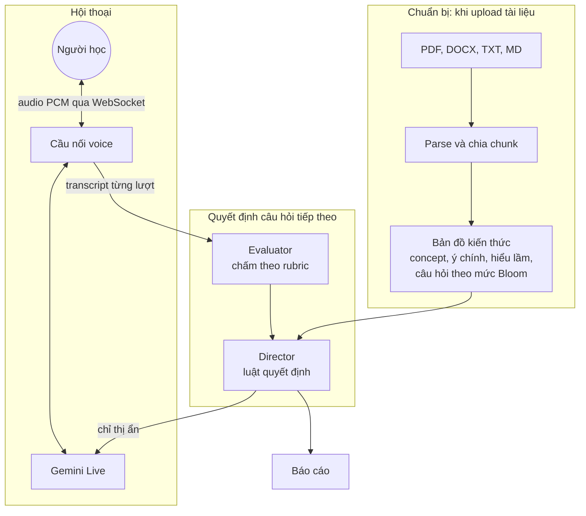

# AI Interviewer

Ứng dụng ôn tập cho sinh viên: tải tài liệu lên, trả lời câu hỏi theo từng mức độ hiểu bằng giọng nói hoặc tin nhắn, rồi xem báo cáo học tập.

- **Giọng nói real-time** qua Gemini Live (`gemini-3.8-live`): hỗ trợ ngắt lời và chế độ giữ nút để nói trong môi trường ồn.
- **Câu hỏi bám tài liệu**: mỗi chủ đề có ý chính, hiểu lầm hay gặp và câu hỏi theo thang Bloom (hiểu, vận dụng, phân tích).
- **Hỏi sâu có kiểm soát**: luật rõ ràng quyết định hỏi sâu, phản biện, gợi ý hay chuyển chủ đề.
- **Đánh giá trong lúc trò chuyện**: người học nghe phản hồi trung tính; hệ thống dùng kết quả để chọn câu hỏi tiếp theo.
- **Báo cáo cho sinh viên**: nêu phần đã nắm, phần cần ôn và độ phủ chủ đề. Buổi dừng sớm không có điểm tổng khi còn chủ đề chưa đánh giá.

## Chạy thử

Cần Python 3.12+ và trình duyệt Chrome hoặc Edge.

```powershell
python -m venv .venv
.\.venv\Scripts\activate
pip install -r requirements.txt
copy .env.example .env
```

Mở `.env`, điền `GEMINI_API_KEY` (lấy miễn phí tại [Google AI Studio](https://aistudio.google.com/apikey)), rồi chạy:

```powershell
uvicorn app.main:app --reload
```

Mở http://localhost:8000. Trình duyệt chỉ cho dùng micro trên `localhost` hoặc HTTPS.

Chạy test (không cần API key, dùng LLM và phiên Gemini Live giả):

```powershell
pytest
```

## Cách hoạt động



1. **Chuẩn bị** (`app/ingest.py`, `app/knowledge.py`): tài liệu được chuẩn hóa Unicode, chia đoạn có số trang. Nếu quá dài, ứng dụng lấy mẫu xuyên suốt tài liệu trước khi `gemini-3.8-flash` sinh bản đồ kiến thức; giao diện báo khi nội dung bị lược bớt.
2. **Hội thoại** (`app/voice.py`): trình duyệt gửi audio 16 kHz, nhận audio 24 kHz. Sau mỗi câu trả lời, Gemini Live ghi nhận ngắn rồi chờ; evaluator và Director chọn câu hỏi tiếp theo, sau đó cầu nối gửi chỉ thị ẩn `[CHỈ THỊ ẨN]` để Live hỏi đúng câu đó.
3. **Đánh giá** (`app/interview/`): evaluator chấm theo ý nghĩa và câu hỏi hiện tại, kể cả câu trả lời ngắn bắt đầu bằng thuật ngữ. Director (code thuần) quyết định hỏi sâu, gợi ý hoặc chuyển chủ đề. Nếu hàng đợi âm thanh bị mất dữ liệu, ứng dụng yêu cầu nói lại thay vì chấm transcript thiếu.
4. **Báo cáo** (`app/interview/report.py`): điểm số tính từ bằng chứng của từng chủ đề; chỉ hiện điểm tổng khi tất cả chủ đề đã có bằng chứng. LLM viết phần nhận xét cho sinh viên.

Ở chế độ **Nhắn tin**, cùng một bộ não được dùng nhưng chạy tuần tự: chấm, ra quyết định, rồi `gemini-3.5-flash-lite` viết câu trả lời. Chế độ này tiện để tinh chỉnh logic phỏng vấn mà không tốn quota Live.

### Luật của director

| Tình huống | Hành động |
| --- | --- |
| Đúng, đủ ý, đạt mức vận dụng | Chuyển chủ đề (hoặc kết thúc nếu hết chủ đề) |
| Đúng nhưng nông, hoặc nghi học thuộc | Hỏi sâu bằng câu hỏi mức Bloom cao hơn |
| Có hiểu lầm | Phản biện bằng tình huống, không nói thẳng là sai |
| Không biết, sai nhiều | Gợi ý một lần, sau đó chuyển chủ đề |
| Hỏi lại, lạc đề, đang nghĩ | Diễn đạt lại, kéo về câu hỏi, động viên (không tính điểm) |
| Hết số lượt cho chủ đề hoặc hết giờ | Chốt điểm, chuyển chủ đề hoặc kết thúc |

Ngưỡng và trọng số nằm ở đầu `app/interview/director.py`.

## Cấu hình (`.env`)

| Biến | Mặc định | Ý nghĩa |
| --- | --- | --- |
| `GEMINI_API_KEY` | | Key Gemini API |
| `APP_ACCESS_TOKEN` | | Token truy cập ứng dụng. Hãy đặt chuỗi ngẫu nhiên dài trước khi triển khai hoặc chia sẻ ứng dụng |
| `BRAIN_MODEL` | `gemini-3.8-flash` | Soạn bản đồ kiến thức, chấm điểm, viết báo cáo |
| `FAST_MODEL` | `gemini-3.5-flash-lite` | Lời người phỏng vấn ở chế độ nhắn tin |
| `LIVE_MODEL` | `gemini-3.8-live` | Hội thoại giọng nói |
| `LIVE_VOICE` | `Kore` | Giọng đọc của AI |
| `VAD_SILENCE_MS` | `1800` | Im lặng bao lâu thì AI được nói; chờ lâu hơn để người học ngập ngừng |
| `VAD_PREFIX_PADDING_MS` | `100` | Phần âm thanh giữ lại trước khi phát hiện bắt đầu nói |
| `INTERVIEW_MINUTES` | `15` | Thời lượng tối đa một buổi |
| `MAX_CONCEPTS_PER_SESSION` | `6` | Số chủ đề tối đa mỗi buổi |
| `MAX_ANSWERS_PER_CONCEPT` | `4` | Số câu trả lời tối đa cho một chủ đề |
| `MAX_HINTS_PER_CONCEPT` | `1` | Số lần gợi ý tối đa cho một chủ đề |

Khi `APP_ACCESS_TOKEN` được cấu hình, API và WebSocket yêu cầu đăng nhập bằng token này.
Giao diện sẽ hỏi token lần đầu và lưu token trong cookie HttpOnly của phiên trình duyệt.
Không commit file `.env`; chỉ commit `.env.example` với placeholder.

## Lưu ý về free tier

- Quota free tính theo project và Google không công bố con số cố định; xem trong AI Studio. Nếu bị lỗi `429` hoặc `1011` (hết quota), đợi vài phút hoặc đổi model trong `.env`.
- Mỗi kết nối Live chỉ kéo dài khoảng 10 phút. Ứng dụng đã bật nén context và session resumption để tự nối lại.
- `gemini-3.8-live` tính token đầu vào suốt lúc mic mở, nên giữ các buổi test ngắn.
- Dữ liệu ở free tier có thể được Google dùng để cải thiện sản phẩm. Đừng test bằng tài liệu hoặc giọng nói nhạy cảm.

## Xử lý sự cố

| Hiện tượng | Cách xử lý |
| --- | --- |
| AI tự ngắt lời chính nó | Đeo tai nghe, hoặc bỏ chọn "Cho phép ngắt lời AI" |
| AI cướp lời khi đang suy nghĩ | Tăng `VAD_SILENCE_MS` (ví dụ 2000), đổi lại phản hồi chậm hơn |
| Tạp âm làm AI dừng hoặc tạo transcript sai | Bật chế độ “Môi trường ồn” (mặc định), giữ nút khi trả lời rồi thả ra. Gemini dùng độ nhạy bắt đầu nói thấp hơn; dùng micro gần miệng nếu vẫn khó nghe |
| AI hiểu thuật ngữ đơn lẻ thành yêu cầu giải thích | Live và evaluator được nhắc đối chiếu câu hỏi hiện tại và trích đoạn nguồn, không tự thêm ý người học chưa nói |
| Nói quá nhỏ hoặc tạp âm làm rơi âm thanh | Thử tai nghe/micro gần miệng và trả lời lại khi ứng dụng yêu cầu; bản ghi nhận dạng vẫn có thể sai nếu âm thanh đến Gemini không rõ |
| PDF tải lên báo không có chữ | PDF scan từ ảnh, cần chạy OCR trước |

## Cấu trúc

```
app/
  main.py            API REST và WebSocket
  voice.py           Cầu nối trình duyệt <-> Gemini Live
  ingest.py          Đọc PDF/DOCX/TXT/MD, chia chunk
  knowledge.py       Sinh và chuẩn hóa bản đồ kiến thức
  prompts.py         Toàn bộ prompt (tiếng Việt)
  llm.py             Gọi Gemini, retry, JSON schema
  storage.py         Lưu JSON trong data/
  interview/
    engine.py        Điều phối phiên phỏng vấn
    director.py      Luật quyết định (không dùng LLM)
    evaluator.py     Chấm từng câu trả lời
    interviewer.py   Lời người phỏng vấn ở chế độ nhắn tin
    report.py        Báo cáo cuối buổi
web/                 Giao diện (HTML/CSS/JS thuần, AudioWorklet cho micro và loa)
tests/               Unit test và test luồng đầy đủ với LLM giả
```

## Giới hạn hiện tại

- Chưa có tài khoản riêng cho từng sinh viên. `APP_ACCESS_TOKEN` là một token chung; cần thêm xác thực và phân quyền theo người dùng trước khi triển khai cho nhiều sinh viên độc lập.
- Kết quả nhận dạng giọng nói và đánh giá vẫn cần kiểm thử thực tế với giọng nói nhỏ, tạp âm và bộ câu trả lời ngắn. VAD và ngữ cảnh tài liệu giảm lỗi nhưng không bảo đảm nhận đúng mọi câu.
- Tài liệu vượt `MAX_DOCUMENT_CHARS` chỉ được lấy mẫu để lập bản đồ kiến thức; báo cáo không chứng nhận đã bao phủ toàn bộ tài liệu.
