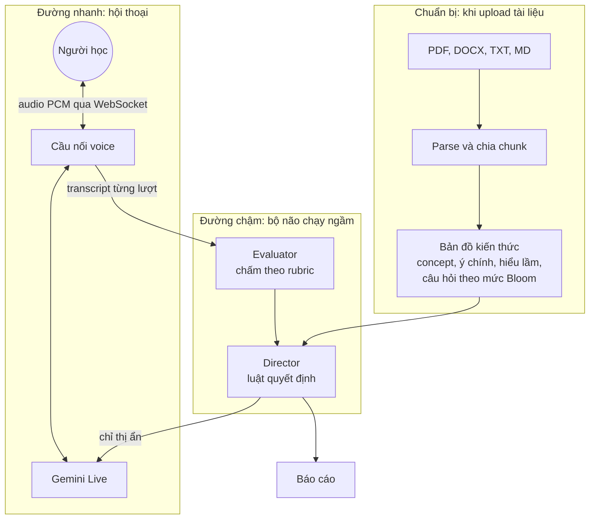

# AI Interviewer

Hệ thống phỏng vấn để kiểm tra người học có thực sự hiểu bài hay chỉ học thuộc. Tải tài liệu lên, AI soạn câu hỏi theo từng mức độ hiểu, trò chuyện real-time bằng giọng nói (có thể ngắt lời), tự hỏi sâu khi câu trả lời còn nông, và chấm điểm ngầm trong suốt buổi.

- **Giọng nói real-time** qua Gemini Live (`gemini-3.8-live`): người học ngắt lời được, AI dừng ngay.
- **Câu hỏi bám tài liệu**: mỗi chủ đề có ý chính, hiểu lầm hay gặp và câu hỏi theo thang Bloom (hiểu, vận dụng, phân tích).
- **Hỏi sâu có kiểm soát**: luật rõ ràng quyết định hỏi sâu, phản biện, gợi ý hay chuyển chủ đề.
- **Đánh giá ngầm**: người học chỉ nghe phản hồi trung tính; giáo viên xem điểm từng lượt trong "Bảng giáo viên".
- **Báo cáo hai góc nhìn**: cho người học (động viên, kế hoạch ôn tập) và cho giáo viên (điểm, mức Bloom, hiểu lầm, trích dẫn).

## Chạy thử

Cần Python 3.12+ và trình duyệt Chrome hoặc Edge.

```powershell
python -m venv .venv
.\.venv\Scripts\activate
pip install -r requirements.txt
copy .env.example .env
```

Mở `.env`, điền `GEMINI_API_KEY` (lấy miễn phí tại [Google AI Studio](https://aistudio.google.com/apikey)), rồi chạy từ thư mục dự án:

```powershell
.\.venv\Scripts\python.exe -m app
```

Lệnh này đọc `.env`, tắt server cũ của chính dự án nếu cổng 8000 đang bị bản đó chiếm, rồi mở http://127.0.0.1:8000. Trình duyệt chỉ cho dùng micro trên `localhost` hoặc HTTPS. Nếu model đang chọn báo quá tải (`503`), ứng dụng tự chuyển sang model dự phòng.

Giao diện mới nằm ở `/` (`web/index.html`, mã trong `web/js/`) và chạy cùng luồng với giao diện cũ: tải tài liệu, chọn phạm vi trang, số câu, thời lượng, chọn Giọng nói (Gemini Live real-time) hoặc Nhắn tin, Bảng giáo viên, báo cáo cho người học và giáo viên. Giao diện cũ vẫn mở được ở `/legacy.html`.

Chạy test (không cần API key, dùng LLM và phiên Gemini Live giả):

```powershell
pytest
```

## Cách hoạt động



1. **Chuẩn bị** (`app/ingest.py`, `app/knowledge.py`): tài liệu được chuẩn hóa Unicode, chia đoạn có số trang, rồi `gemini-3.8-flash` sinh bản đồ kiến thức. Làm trước bước này giúp lúc phỏng vấn không phải chờ, và evaluator có "đáp án chuẩn" để chấm nhất quán.
2. **Hội thoại** (`app/voice.py`): trình duyệt gửi audio 16 kHz, nhận audio 24 kHz. Voice agent tự hỏi follow-up ngay theo "thẻ chủ đề" bí mật, nên không phải chờ bộ não.
3. **Bộ não** (`app/interview/`): sau mỗi lượt, evaluator chấm độ đúng, độ đủ ý, lập luận, mức Bloom, dấu hiệu học thuộc và hiểu lầm. Director (code thuần, không gọi LLM) quyết định bước tiếp theo, rồi gửi chỉ thị ẩn `[CHỈ THỊ ẨN]` vào phiên Gemini Live cho lượt nói kế tiếp.
4. **Báo cáo** (`app/interview/report.py`): điểm số tính bằng code từ mức hiểu từng chủ đề (có trọng số theo độ quan trọng); LLM chỉ viết phần nhận xét.

Ở chế độ **Nhắn tin**, cùng một bộ não được dùng nhưng chạy tuần tự: chấm, ra quyết định, rồi `gemini-3.5-flash-lite` viết câu trả lời. Chế độ này tiện để tinh chỉnh logic phỏng vấn mà không tốn quota Live.

### Luật của director

| Tình huống | Hành động |
| --- | --- |
| Đúng, đủ ý, đạt mức vận dụng | Chuyển chủ đề (hoặc kết thúc nếu hết chủ đề) |
| Đúng nhưng nông, hoặc nghi học thuộc | Hỏi sâu bằng câu hỏi mức Bloom cao hơn |
| Có hiểu lầm | Phản biện bằng tình huống, không nói thẳng là sai |
| Không biết, sai nhiều | Gợi ý một lần, sau đó chuyển chủ đề |
| Hỏi lại, lạc đề, đang nghĩ | Diễn đạt lại, kéo về câu hỏi, động viên (không tính điểm) |
| Hết số lượt cho chủ đề hoặc hết giờ | Chốt điểm, chuyển chủ đề hoặc kết thúc |

Ngưỡng và trọng số nằm ở đầu `app/interview/director.py`.

## Cấu hình (`.env`)

| Biến | Mặc định | Ý nghĩa |
| --- | --- | --- |
| `GEMINI_API_KEY` | | Key Gemini API |
| `APP_ACCESS_TOKEN` | | Token truy cập ứng dụng. Hãy đặt chuỗi ngẫu nhiên dài trước khi triển khai hoặc chia sẻ ứng dụng |
| `BRAIN_MODEL` | `gemini-3.8-flash` | Soạn bản đồ kiến thức, chấm điểm, viết báo cáo |
| `FAST_MODEL` | `gemini-3.5-flash-lite` | Lời người phỏng vấn ở chế độ nhắn tin |
| `LIVE_MODEL` | `gemini-3.8-live` | Hội thoại giọng nói |
| `LIVE_VOICE` | `Kore` | Giọng đọc của AI |
| `VAD_SILENCE_MS` | `1000` | Im lặng bao lâu thì AI được nói; giảm để AI đáp nhanh hơn, tăng nếu AI hay cướp lời khi người học ngập ngừng |
| `VAD_PREFIX_PADDING_MS` | `100` | Thời gian xác nhận bắt đầu nói; giảm để nhận câu trả lời ngắn |
| `VAD_START_SENSITIVITY` | `high` | `low` khi phòng ồn để tạp âm không làm AI dừng nói |
| `LIVE_THINKING_BUDGET` | `0` | Token suy nghĩ của Gemini Live trước mỗi lượt nói; `0` đáp nhanh nhất, `-1` để model tự quyết |
| `SPEECH_LANGUAGE` | `vi-VN` | Ngôn ngữ chính khi nhận dạng giọng nói và khi AI nói |
| `TERM_LANGUAGES` | `en-US` | Ngôn ngữ của thuật ngữ người học hay chêm vào (nhiều mã cách nhau bằng dấu phẩy) |
| `LLM_TIMEOUT_S` | `30` | Một lần gọi Gemini quá thời gian này thì chuyển sang model dự phòng |
| `KNOWLEDGE_TIMEOUT_S` | `240` | Như trên, riêng cho bước soạn bản đồ kiến thức khi tải tài liệu |
| `INTERVIEW_MINUTES` | `15` | Thời lượng tối đa một buổi |
| `MAX_CONCEPTS_PER_SESSION` | `6` | Số chủ đề tối đa mỗi buổi |
| `MAX_ANSWERS_PER_CONCEPT` | `4` | Số câu trả lời tối đa cho một chủ đề |
| `MAX_HINTS_PER_CONCEPT` | `1` | Số lần gợi ý tối đa cho một chủ đề |

Model báo quá tải (429/503) hoặc quá giờ sẽ bị bỏ qua 60 giây để các lượt sau đi thẳng tới model dự phòng.

Nhận dạng giọng nói trong phòng ồn và khi chêm thuật ngữ tiếng Anh:

- Trình duyệt lọc nhiễu (`noiseSuppression`, `echoCancellation`), sau đó `web/capture-worklet.js` lọc thông cao ~120 Hz và dùng cổng nhiễu tự học mức ồn nền trước khi gửi audio.
- Gemini Live được gợi ý ngôn ngữ (`SPEECH_LANGUAGE` + `TERM_LANGUAGES`) và danh sách thuật ngữ lấy từ tài liệu, nên nghe đúng các từ như TCP, checksum, multiplexing mà bản chép vẫn giữ tiếng Việt.
- Nếu người học hoặc AI nói phần lớn bằng tiếng nước ngoài, máy chủ gửi ngay chỉ thị ẩn nhắc AI quay lại tiếng Việt.

Khi `APP_ACCESS_TOKEN` được cấu hình, API và WebSocket yêu cầu đăng nhập bằng token này.
Giao diện sẽ hỏi token lần đầu và lưu token trong cookie HttpOnly của phiên trình duyệt.
Không commit file `.env`; chỉ commit `.env.example` với placeholder.

## Lưu ý về free tier

- Quota free tính theo project và Google không công bố con số cố định; xem trong AI Studio. Nếu bị lỗi `429`, `503` hoặc `1011` (hết quota hoặc model quá tải), ứng dụng tự thử model dự phòng. Có thể đổi model trong `.env` rồi chạy lại `.\.venv\Scripts\python.exe -m app`.
- Mỗi kết nối Live chỉ kéo dài khoảng 10 phút. Ứng dụng đã bật nén context và session resumption để tự nối lại.
- `gemini-3.8-live` tính token đầu vào suốt lúc mic mở, nên giữ các buổi test ngắn.
- Dữ liệu ở free tier có thể được Google dùng để cải thiện sản phẩm. Đừng test bằng tài liệu hoặc giọng nói nhạy cảm.

## Xử lý sự cố

| Hiện tượng | Cách xử lý |
| --- | --- |
| AI tự ngắt lời chính nó | Đeo tai nghe, hoặc bỏ chọn "Cho phép ngắt lời AI" |
| AI cướp lời khi đang suy nghĩ | Tăng `VAD_SILENCE_MS` (ví dụ 2000), đổi lại phản hồi chậm hơn |
| Tạp âm làm AI dừng | Thử tăng `VAD_PREFIX_PADDING_MS` (ví dụ 200); tăng quá cao có thể bỏ sót câu ngắn |
| AI hiểu thuật ngữ đơn lẻ thành yêu cầu giải thích | Live được nhắc xử lý theo câu hỏi gần nhất và đối chiếu trích đoạn nguồn khi mở phiên/chuyển chủ đề |
| PDF tải lên báo không có chữ | PDF scan từ ảnh, cần chạy OCR trước |

## Cấu trúc

```
app/
  main.py            API REST và WebSocket
  voice.py           Cầu nối trình duyệt <-> Gemini Live
  ingest.py          Đọc PDF/DOCX/TXT/MD, chia chunk
  knowledge.py       Sinh và chuẩn hóa bản đồ kiến thức
  prompts.py         Toàn bộ prompt (tiếng Việt)
  llm.py             Gọi Gemini, retry, JSON schema
  storage.py         Lưu JSON trong data/
  interview/
    engine.py        Điều phối phiên phỏng vấn
    director.py      Luật quyết định (không dùng LLM)
    evaluator.py     Chấm từng câu trả lời
    interviewer.py   Lời người phỏng vấn ở chế độ nhắn tin
    report.py        Báo cáo cuối buổi
web/                 Giao diện (HTML/CSS/JS thuần, AudioWorklet cho micro và loa)
tests/               Unit test và test luồng đầy đủ với LLM giả
```

## Hướng phát triển tiếp

- Đăng nhập và tách "Bảng giáo viên" khỏi giao diện người học (hiện chưa có xác thực, chỉ dùng để test).
- Đo tín hiệu giọng nói: thời gian bắt đầu trả lời, mức ngập ngừng.
- AI chủ động ngắt lời khi người học nói lan man (cần tự quản lý VAD).
- Pipeline dự phòng khi hết quota Live: Deepgram Nova-3 (STT tiếng Việt) và VieNeu-TTS (TTS tiếng Việt chạy local).
- Vector DB khi cần trả lời câu hỏi ngoài kịch bản, và Postgres khi có nhiều người dùng.
